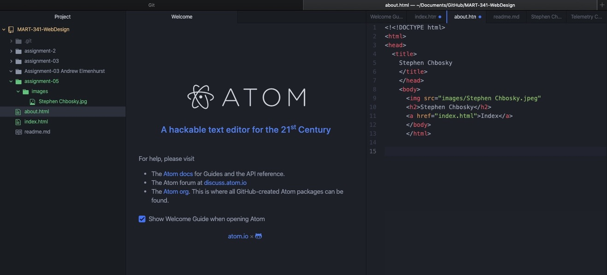
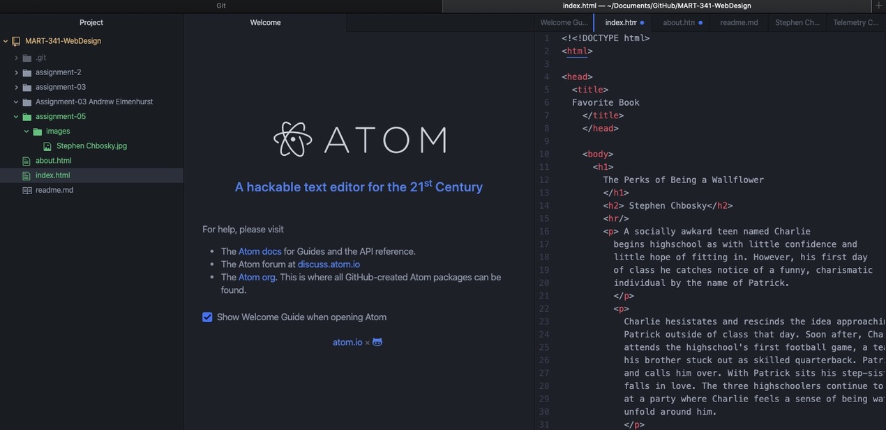

# Andrew Elmenhurst

1. I went back you Youtube.com in 2005.
2. The user interface is incredibly different. The search bar is the primary subject of the home screen, not like today. I could tell the algorithm was not in effect yet, as there were no suggested videos.
3. The biggest change I see is the absence of the suggested videos and the difference between the two aesthetics.
4. My experience with these last few topics have been challenging but rewarding. Ultimately, I have found that remote learning is difficult for brand new concepts that are completely foreign to me. However, the help from Michael has been a game changer for this class. I am beginning to have some "Aha" moments with html and markdown.

